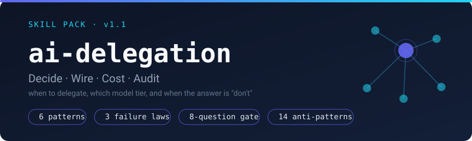
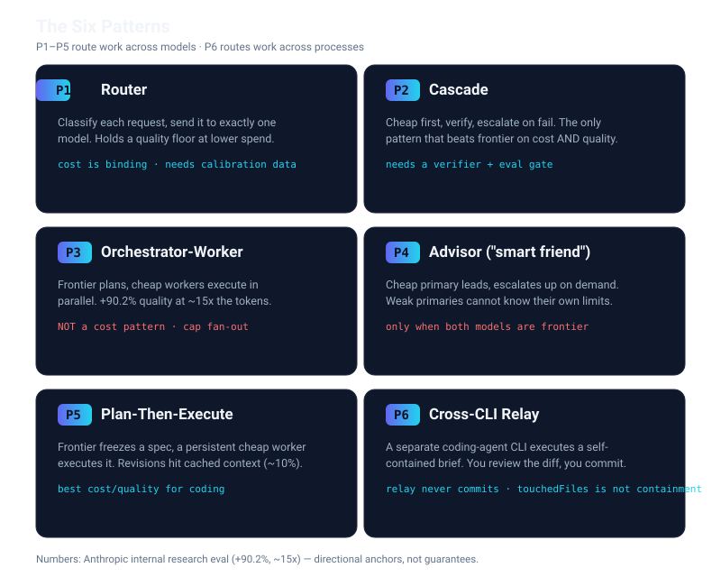
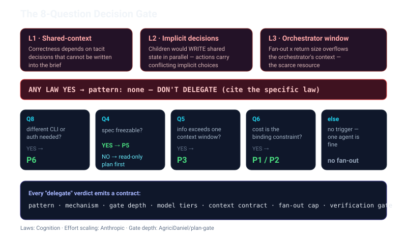

# AI Delegation

<p align="center">
  
</p>

Decide when and how to delegate work across AI agents and model tiers — without guesswork, and with the ability to say "don't delegate."

## What it does

- **Decides**: runs an 8-question decision gate over three failure laws (shared-context, implicit-decisions, orchestrator-window) and recommends one of six delegation patterns — Router, Cascade, Orchestrator-Worker, Advisor, Plan-Then-Execute, Cross-CLI Relay — with per-role model tiers and a full context contract, or an explicit `pattern: none` with the specific law that blocks it.
- **Wires**: generates harness-specific config (subagent definitions, orchestrator instruction blocks, routing rules) for opencode, Claude Code, Codex, Gemini CLI, and Cursor — plus cross-CLI relay artifacts (self-contained briefs, fleet lanes, dispatch procedures) for P6.
- **Costs**: models the economics of all six patterns against an always-frontier baseline, with break-even escalation rates, local-endpoint pricing, and quality-floor warnings.
- **Audits**: statically scans an existing delegation setup for 14 named anti-patterns (AP1–AP14) with severity-ranked, specific fixes.

Grounded in a source-tracked evidence base (Anthropic's multi-agent research system, Cognition's context-engineering work, RouteLLM/FrugalGPT, DELEGATE-52, amElnagdy/delegate-skills) where every claim carries a confidence level and a refresh date.

## The Six Patterns

<p align="center">
  
</p>

## The Decision Gate

<p align="center">
  
</p>

## Installation

### Agent skills directory (default)

```bash
git clone https://github.com/MostaDaoud/ai-delegation.git
cd ai-delegation
bash install.sh
```

Sub-skills install as sibling folders under `~/.agents/skills/` (Agent Skills layout):

```
~/.agents/skills/
  ai-delegation/
  ai-delegation-decide/
  ai-delegation-wire/
  ai-delegation-cost/
  ai-delegation-audit/
```

### Skill registry (.skill zip)

1. Download the latest release (`.skill` zip)
2. Go to Settings > Capabilities > Skills
3. Click "Upload skill"
4. Select the downloaded `.zip` file

## Commands

| Command | Description |
|---------|-------------|
| `/ai-delegation` | Interactive: walk the 7-question gate, then route |
| `/ai-delegation decide` | Should I delegate? Pattern + model tiers + context contract |
| `/ai-delegation wire` | Generate harness-specific delegation config |
| `/ai-delegation cost` | Run the P1–P5 economics calculator |
| `/ai-delegation audit` | Scan a config for AP1–AP12 anti-patterns |

## Examples

### Example 1: Should I delegate this?

```
User: "should I delegate this research to subagents"
```

The `decide` sub-skill runs the failure-law gate: no shared-context dependency, no parallel writes, orchestrator window fits → recommends **P3 Orchestrator-Worker** with a fan-out cap of 5, effort-scaling rules, and a clean-context verification gate.

### Example 2: When NOT to delegate

```
User: "should I have five subagents write to the same database tables in parallel"
```

The gate stops at **L2 (implicit-decisions law)**: actions carry implicit decisions; parallel writers make conflicting ones. Output: `pattern: none`, reason `parallel-writes`, fix: single-thread writes or isolate by worktree.

### Example 3: Cost check

```
User: "will delegating to a cheap model actually save money"
```

`delegation_calculator.py` compares always-frontier / P1 / P2 / P3 / P5 on your price table and traffic mix, and warns when your cascade escalation rate exceeds break-even (cascade then costs MORE than frontier).

## Architecture

```
ai-delegation/                  # Orchestrator (routing + discipline gates)
  SKILL.md
  references/                   # evidence, patterns, decision-gate, model-tier-matrix,
                                # anti-patterns, platform-map
  scripts/                      # delegation_calculator.py, audit_delegation.py
  assets/templates/             # subagent-definition, orchestrator-instructions, routing-rules
  evals/                        # 26-case eval set (trigger + behavior)
skills/
  ai-delegation-decide/         # 7-question gate -> decision contract
  ai-delegation-wire/           # contract -> harness config
  ai-delegation-cost/           # economics across P1-P5
  ai-delegation-audit/          # AP1-AP12 scan + evidence refresh
```

## Key rules the skill enforces

1. **Delegate down, not up** — strong→cheap beats cheap→strong on token accounting.
2. **Never let the weaker model own the escalation decision.**
3. **Effort scaling is mandatory** for orchestrator-worker (no 50-subagent stampedes).
4. **Artifacts to filesystem, summaries to context** — avoids the "game of telephone."
5. **Fan-out is capped** (default 5) and **every delegation has a verification gate** on a clean context.

## Requirements

- Any Agent Skills-compatible harness (opencode, Claude Code, Codex, Gemini CLI, Cursor)
- Python 3.10+ for the scripts (no third-party packages required; PyYAML optional for YAML config audits)

## Credits

This skill is based partly on two excellent open-source projects — both MIT licensed. Thank you.

- **[amElnagdy/delegate-skills](https://github.com/amElnagdy/delegate-skills)** (MIT) — the **P6 Cross-CLI Relay** pattern is grounded in its architecture: the review-first loop (brief → dispatch → poll → review diff → *you* land the commit), the `delegate-relay.result.v1` result contract, fleet lanes with fail-closed content-bound configs, the "relay never commits" invariant, and the measured per-CLI autonomy caveats (aider auto-commits, grok un-preventable writes, `touchedFiles`-is-not-containment). Cited in-repo as DS1–DS4 in [`ai-delegation/references/evidence.md`](ai-delegation/references/evidence.md); mechanics in [`ai-delegation/references/cross-cli-relay.md`](ai-delegation/references/cross-cli-relay.md). If you install delegate-skills, its per-CLI `*-delegate` skills serve as the reference relays this skill wires against.
- **[AgriciDaniel/skill-forge](https://github.com/AgriciDaniel/skill-forge)** (MIT) — the skill itself was planned, scaffolded, validated (0–100 score gate), evaluated, benchmarked, and packaged through the skill-forge architecture (complexity tiers, SKILL.md conventions, progressive disclosure, init/validate/package/eval/benchmark pipeline) via its discipline-fork.

## License

MIT — see [LICENSE](LICENSE).
